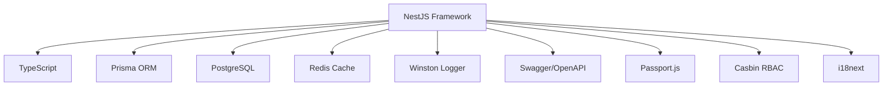
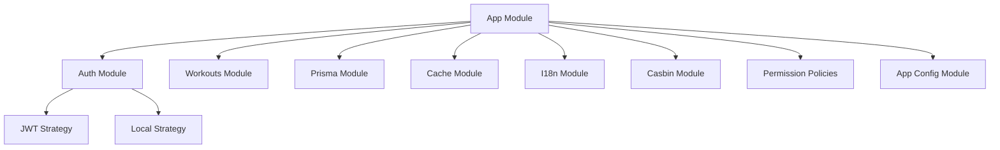
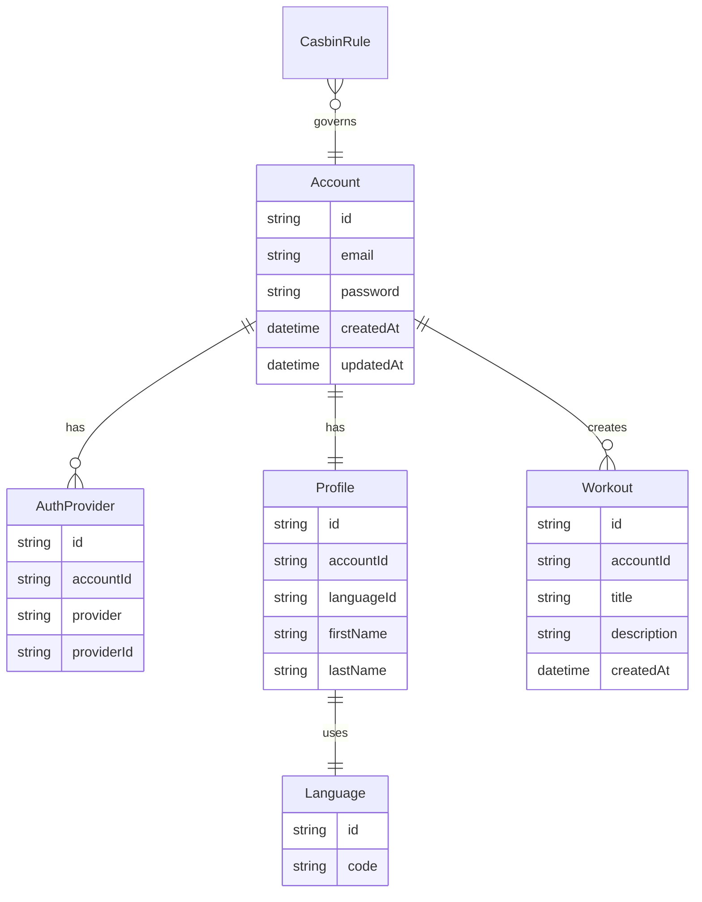
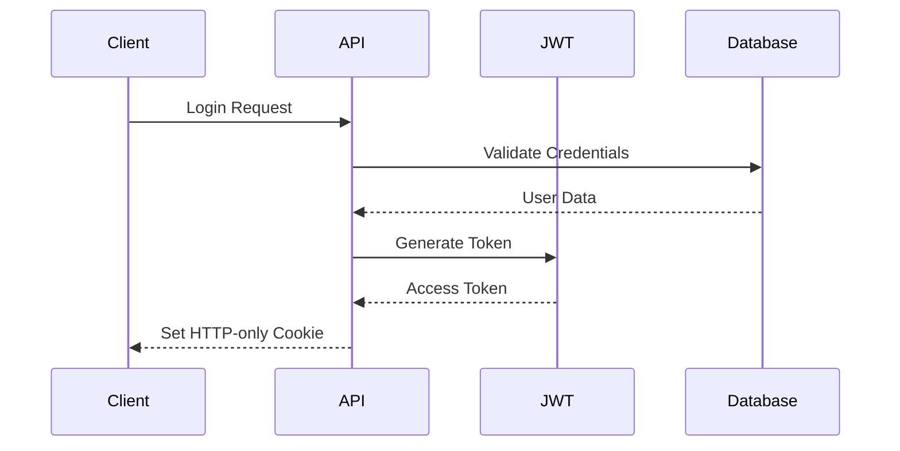
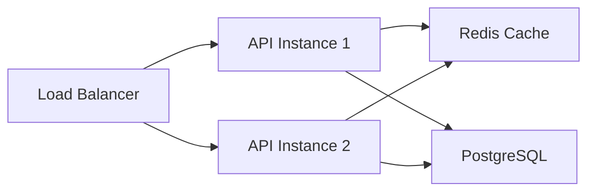

# Bit-Trove Backend Architecture Documentation

## Table of Contents
1. [Overview](#overview)
2. [Technical Stack](#technical-stack)
3. [Architecture](#architecture)
4. [Data Model](#data-model)
5. [Security](#security)
6. [Internationalization](#internationalization)
7. [API Documentation](#api-documentation)
8. [Development Guidelines](#development-guidelines)

## Overview

Bit-Trove is a modern web application built with a focus on scalability, maintainability, and security. The backend is implemented using NestJS, a progressive Node.js framework that provides an excellent foundation for building scalable server-side applications.

## Technical Stack



### Core Technologies
- **Framework**: NestJS 11.x
- **Language**: TypeScript 5.8
- **ORM**: Prisma 6.8
- **Authentication**: Passport.js with JWT
- **Authorization**: Casbin RBAC
- **Caching**: Redis
- **Testing**: Vitest with Playwright
- **API Documentation**: Swagger/OpenAPI
- **Logging**: Winston with daily rotation
- **Internationalization**: i18next
- **Code Quality**: Biome
- **Package Manager**: Yarn

## Architecture

### Module Structure



### Key Modules

1. **App Module (`app.module.ts`)**
   - Root module orchestrating all application components
   - Configures global middleware and guards
   - Sets up Winston logging

2. **Auth Module**
   - Handles authentication and authorization
   - Implements JWT-based authentication
   - Integrates with Casbin for RBAC

3. **Prisma Module**
   - Database access layer
   - Manages database connections
   - Provides repository pattern implementation

4. **Cache Module**
   - Implements caching strategies
   - Redis integration
   - Cache invalidation policies

5. **I18n Module**
   - Handles internationalization
   - Supports multiple languages
   - Message translation management

## Data Model



## Security

### Authentication Flow



### Authorization

- **RBAC Implementation**: Using Casbin for flexible role-based access control
- **JWT Guard**: Global guard for protecting routes
- **Cookie-based Token Storage**: Secure HTTP-only cookies
- **CORS**: Configured for specific origins

## API Documentation

- Swagger UI available at `/api/:version/docs`
- ReDoc alternative documentation
- OpenAPI specification exposed at `/swagger-json`

### API Versioning
- URI-based versioning enabled
- Prefix: `/api`

## Development Guidelines

### Project Structure
```
backend/
├── src/
│   ├── modules/           # Feature modules
│   │   ├── app-config/   # Application configuration
│   │   ├── auth/        # Authentication and authorization
│   │   ├── i18n/       # Internationalization
│   │   └── ...         # Other feature modules
│   ├── shared/          # Shared utilities and helpers
│   ├── main.ts         # Application entry point
│   └── app.module.ts   # Root module
├── prisma/
│   └── schema/         # Database schemas
├── scripts/           # Utility scripts
└── tests/            # Test files
```

### Best Practices
1. **Modular Architecture**
   - Feature-based module organization
   - Clear separation of concerns
   - Dependency injection
   - Strong typing with TypeScript

2. **Error Handling**
   - Global exception filter
   - Structured error responses
   - i18n support for error messages
   - Type-safe error handling

3. **Code Quality**
   - Biome for linting and formatting
   - Strict TypeScript configuration
   - Comprehensive test coverage
   - Code review guidelines

3. **Logging**
   - Structured logging with Winston
   - Daily log rotation
   - Different log levels for development/production

4. **Testing**
   - Unit tests with Vitest
   - E2E testing support
   - Coverage reporting

### Performance Considerations
1. **Caching Strategy**
   - Redis for distributed caching
   - Appropriate cache invalidation
   - Cache-first approach where applicable

2. **Database Optimization**
   - Prisma for type-safe database queries
   - Efficient indexing
   - Connection pooling

3. **API Performance**
   - Response compression
   - Rate limiting
   - Efficient query patterns

## Deployment

The application is designed to be deployed in a containerized environment with the following considerations:



### Environment Configuration
- Configuration via environment variables
- Separate configurations for development/production
- Secure secrets management

### Monitoring
- Winston logging integration
- Daily log rotation
- Error tracking and reporting

## Future Considerations

1. **Scalability**
   - Horizontal scaling support
   - Microservices architecture potential
   - Message queue integration

2. **Feature Roadmap**
   - Enhanced authentication methods
   - Real-time functionality
   - Advanced caching strategies

3. **Technical Debt**
   - Regular dependency updates
   - Code quality monitoring
   - Performance optimization

## Contributing

Please refer to the project's contributing guidelines for information on:
- Code style and formatting
- Pull request process
- Testing requirements
- Documentation standards