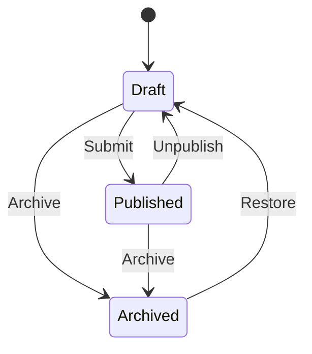

# Blog Post Management - Product Requirements Document

## 1. Overview

### 1.1 Purpose
This document outlines the requirements for implementing blog post management functionality in our personal programming blog web application. The system will provide a foundation for content management that can be extended to other content types in the future.

### 1.2 Target Users
- Content Authors (Programmers/Technical Writers)
- Content Managers/Editors
- System Administrators
- Blog Readers (for context)

### 1.3 Success Metrics
- Successful creation and management of multilingual blog posts
- Efficient content workflow from draft to publication
- High author satisfaction with the content management experience
- Reduced time-to-publish for new content

## 2. Base Entity Concept

### 2.1 Base Content Entity
All content types (including blog posts) should inherit from a base content entity with common attributes:
- Unique identifiers
- Creation timestamp
- Last modification timestamp
- Publication status
- Publication timestamp
- Author information
- Translation references
- Audit trail

## 3. Blog Post Requirements

### 3.1 Core Attributes
- Title
- Content body (TipTap-compatible JSON blocks)
- Slug (URL-friendly identifier)
- Meta description (for SEO)
- Featured image
- Tags/Categories
- Reading time estimate
- Visibility status (draft/published/archived)
- Author reference
- Language identifier
- Original content reference (for translations)
- Created/Updated timestamps

### 3.2 Technical Implementation
- **Frontend**: Remix with Feature Slice Design
- **Editor**: TipTap for rich text editing
- **State**: React Router + Jotai for state management
- **API**: NestJS with Domain-Driven Design
- **Database**: PostgreSQL with Prisma ORM
- **Cache**: Redis for performance optimization
- **Search**: Full-text search with PostgreSQL
- **Images**: Cloud storage with local fallback
- **i18n**: i18next for translations

### 3.2 States and Transitions


## 4. User Stories

### 4.1 Content Creation
1. **Create Draft Post**
   - As an author
   - I want to create a new blog post draft
   - So that I can start writing content without making it public
   - Acceptance Criteria:
     * Can create post with tranlations: title, seo and content
     * Post is saved as draft
     * System generates a unique slug
     * System records creation timestamp and author

### 4.2 Content Management
3. **Edit Existing Post**
   - As an author or content manager
   - I want to edit an existing post
   - So that I can update or improve the content
   - Acceptance Criteria:
     * Can modify all post attributes
     * System records modification timestamp
     * Original author is preserved

4. **Manage Post Status**
   - As an author or content manager
   - I want to change the status of a post
   - So that I can control its visibility
   - Acceptance Criteria:
     * Can change between draft/published/archived states
     * Status changes are logged
     * Appropriate notifications are sent

### 4.3 Translation Management
5. **Create Translation**
   - As an author or translator
   - I want to create a translation of an existing post
   - So that content is available in multiple languages
   - Acceptance Criteria:
     * Can create new translation linked to original
     * Translation has its own workflow status
     * Original post links to translations
     * Language is clearly indicated

6. **Sync Translation Updates**
   - As a content manager
   - I want to be notified when original content changes
   - So that translations can be updated accordingly
   - Acceptance Criteria:
     * System flags translations when original changes
     * Notification sent to translation owners


## 5. Technical Requirements

### 5.1 API Endpoints
```typescript
// Blog Post Routes (v1)
POST   /api/v1/posts           // Create draft
GET    /api/v1/posts          // List posts with filters
GET    /api/v1/posts/:id      // Get single post
PUT    /api/v1/posts/:id      // Update post
DELETE /api/v1/posts/:id      // Archive post
PUT    /api/v1/posts/:id/status // Update status
GET    /api/v1/posts/search   // Search posts
```

### 5.2 Authorization Rules
```typescript
// RBAC with Casbin
const rules = {
  Author: {
    can: ['create', 'read', 'update'],
    on: ['own_posts']
  },
  Editor: {
    can: ['read', 'update', 'publish'],
    on: ['all_posts']
  },
  Admin: {
    can: ['manage'],
    on: ['all']
  }
};
```

### 5.3 Data Validation
```typescript
interface BlogPost {
  id: string;
  title: string;          // Required, max 200 chars
  content: TipTapJSON[];  // Required, valid JSON structure
  slug: string;           // Unique, URL-safe
  meta: {
    title: string;       // Max 60 chars
    description: string; // Max 160 chars
    keywords: string[];  // Max 10 keywords
  };
  status: 'draft' | 'published' | 'archived';
  authorId: string;      // Valid user reference
  language: string;      // Valid language code
  originalPostId?: string; // For translations
  createdAt: Date;
  updatedAt: Date;
}
```

## 6. Future Considerations

### 6.1 Extensibility
- Support for additional content types
- Enhanced media management
- Advanced SEO features
- Content analytics
- AI-assisted translation
- Automated content quality checks

### 6.2 Integration Points
- SEO tools
- Social media platforms
- Newsletter systems
- Analytics platforms
- Translation services

## 7. Success Criteria

### 7.1 Performance Metrics
- API response time < 200ms for CRUD operations
- 99.9% uptime for content serving
- < 1s average save time for drafts
- Zero data loss incidents

### 7.2 Quality Metrics
- 100% data validation coverage
- No unauthorized access incidents

## 8. Timeline and Phases

### 8.1 Phase 1 - Core Functionality (MVP)
- Basic CRUD operations
- Draft management
- Simple publishing workflow
- Basic authorization
- Translation management

### 8.2 Phase 2 - Enhanced Features
- Advanced authorization

### 8.3 Phase 3 - Advanced Features
- Analytics integration
- Advanced media management
- API extensions for other content types
- Integration with external services
- Auto saving drafts