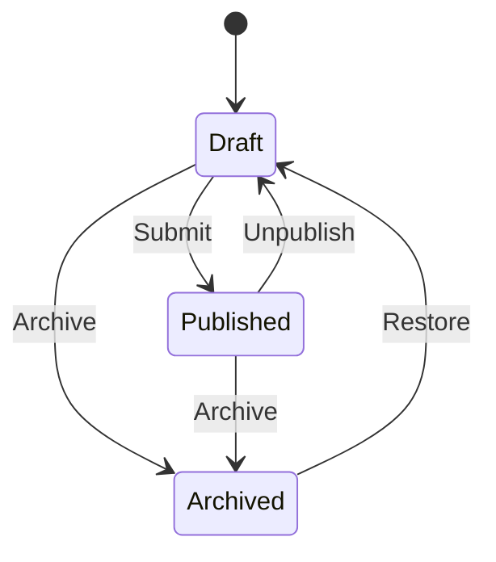

# Feature: Blog Post Management

## Overview
This feature provides comprehensive blog post management functionality for our personal programming blog web application. The system enables content authors to create, edit, publish, and manage multilingual blog posts with a robust workflow from draft to publication.

## Problem Statement
Content authors need a comprehensive system to manage blog posts with the following challenges:
- No centralized content management system
- Lack of multilingual support for blog posts
- Missing workflow management for content lifecycle
- No proper SEO management tools
- Inefficient content creation and editing process

## Goals
- Provide a complete blog post management system
- Support multilingual content creation and management
- Implement proper content workflow (draft → published → archived)
- Enable SEO optimization for blog posts
- Create a foundation for future content types

## User Stories

### Content Creation
**US-001: Create Draft Post**
- **As a** content author
- **I want to** create a new blog post draft
- **So that** I can start writing content without making it public
- **Acceptance Criteria:**
  - Can create post with translations: title, SEO, and content
  - Post is saved as draft status
  - System generates a unique slug
  - System records creation timestamp and author

**US-002: Edit Existing Post**
- **As a** content author or manager
- **I want to** edit an existing blog post
- **So that** I can update or improve the content
- **Acceptance Criteria:**
  - Can modify all post attributes
  - System records modification timestamp
  - Original author is preserved

### Content Management
**US-003: Manage Post Status**
- **As a** content author or manager
- **I want to** change the status of a blog post
- **So that** I can control its visibility
- **Acceptance Criteria:**
  - Can change between draft/published/archived states
  - Status changes are logged
  - Appropriate notifications are sent

**US-004: View Blog Post List**
- **As a** content manager
- **I want to** view all blog posts with filtering options
- **So that** I can manage content effectively
- **Acceptance Criteria:**
  - Can filter by status, author, language
  - Can search by title and content
  - Pagination support for large lists

### Translation Management
**US-005: Create Translation**
- **As a** content author or translator
- **I want to** create a translation of an existing blog post
- **So that** content is available in multiple languages
- **Acceptance Criteria:**
  - Can create new translation linked to original
  - Translation has its own workflow status
  - Original post links to translations
  - Language is clearly indicated

**US-006: Sync Translation Updates**
- **As a** content manager
- **I want to** be notified when original content changes
- **So that** translations can be updated accordingly
- **Acceptance Criteria:**
  - System flags translations when original changes
  - Notification sent to translation owners

## Functional Requirements

### Core Attributes
- **Title**: Required, max 200 characters
- **Content Body**: TipTap-compatible JSON blocks
- **Slug**: URL-friendly identifier, unique
- **Meta Description**: For SEO, max 160 characters
- **Featured Image**: Optional image for social sharing
- **Tags/Categories**: Multiple tags support
- **Reading Time Estimate**: Calculated automatically
- **Visibility Status**: draft/published/archived
- **Author Reference**: Link to account
- **Language Identifier**: ISO language code
- **Original Content Reference**: For translations
- **Timestamps**: Created/Updated dates

### Content States and Transitions


### API Endpoints
```typescript
// Blog Post Routes (v1)
POST   /api/v1/posts           // Create draft
GET    /api/v1/posts          // List posts with filters
GET    /api/v1/posts/:id      // Get single post
PUT    /api/v1/posts/:id      // Update post
DELETE /api/v1/posts/:id      // Archive post
PUT    /api/v1/posts/:id/status // Update status
GET    /api/v1/posts/search   // Search posts
```

### Authorization Rules
```typescript
// RBAC with Casbin
const rules = {
  Author: {
    can: ['create', 'read', 'update'],
    on: ['own_posts']
  },
  Editor: {
    can: ['read', 'update', 'publish'],
    on: ['all_posts']
  },
  Admin: {
    can: ['manage'],
    on: ['all']
  }
};
```

## Technical Design

### Architecture
- **Frontend**: Remix with Feature Slice Design
- **Editor**: TipTap for rich text editing
- **State**: React Router + Jotai for state management
- **API**: NestJS with Domain-Driven Design
- **Database**: PostgreSQL with Prisma ORM
- **Cache**: Redis for performance optimization
- **Search**: Full-text search with PostgreSQL
- **Images**: Cloud storage with local fallback
- **i18n**: i18next for translations

### Data Model
```typescript
interface BlogPost {
  id: string;
  title: string;          // Required, max 200 chars
  content: TipTapJSON[];  // Required, valid JSON structure
  slug: string;           // Unique, URL-safe
  meta: {
    title: string;       // Max 60 chars
    description: string; // Max 160 chars
    keywords: string[];  // Max 10 keywords
  };
  status: 'draft' | 'published' | 'archived';
  authorId: string;      // Valid user reference
  language: string;      // Valid language code
  originalPostId?: string; // For translations
  createdAt: Date;
  updatedAt: Date;
}
```

## Non-Functional Requirements

### Performance Metrics
- API response time < 200ms for CRUD operations
- 99.9% uptime for content serving
- < 1s average save time for drafts
- Zero data loss incidents

### Quality Metrics
- 100% data validation coverage
- No unauthorized access incidents
- Comprehensive test coverage (>90%)

### Scalability
- Support for multiple content types
- Efficient handling of large content volumes
- Optimized database queries with proper indexing

## Tests

### Unit Tests
- Blog post creation and validation
- Content state transitions
- Authorization rules
- Translation management
- SEO metadata handling

### Integration Tests
- API endpoint functionality
- Database operations
- Frontend component rendering
- End-to-end user workflows

### User Acceptance Tests
- Content creation workflow
- Publishing process
- Translation management
- Search and filtering functionality

## Notes

### Implementation Phases
1. **Phase 1 - Core Functionality (MVP)**
   - Basic CRUD operations
   - Draft management
   - Simple publishing workflow
   - Basic authorization
   - Translation management

2. **Phase 2 - Enhanced Features**
   - Advanced authorization
   - SEO optimization tools
   - Content analytics

3. **Phase 3 - Advanced Features**
   - Analytics integration
   - Advanced media management
   - API extensions for other content types
   - Integration with external services
   - Auto saving drafts

### Future Considerations
- Support for additional content types
- Enhanced media management
- Advanced SEO features
- Content analytics
- AI-assisted translation
- Automated content quality checks
- Integration with SEO tools, social media platforms, newsletter systems